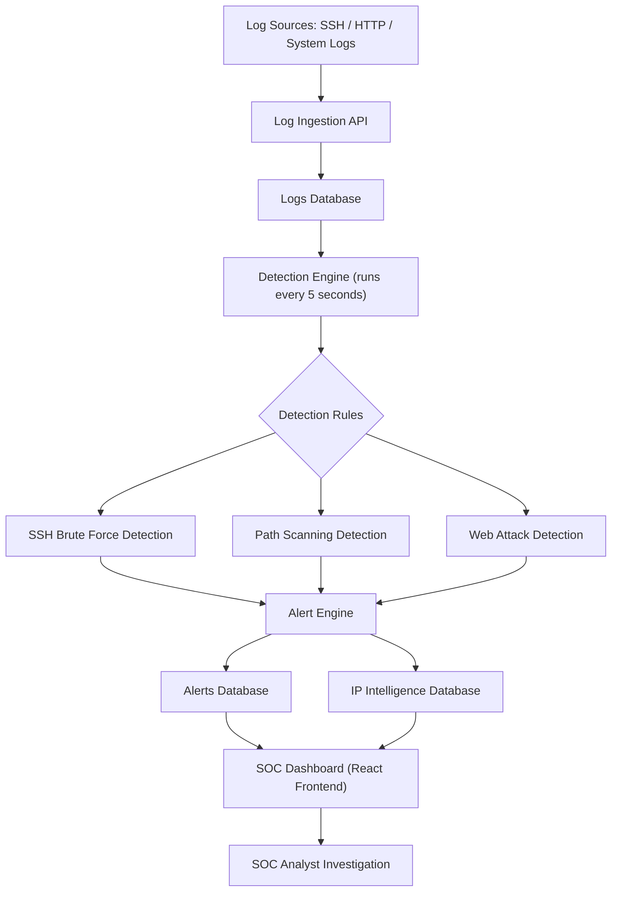

# Sentinel SOC — Log Analysis & SIEM

📐 System Architecture → See ARCHITECTURE.md

---

## 📦 Current Release

**Version:** v0.2.0

Sentinel SOC follows semantic versioning:

MAJOR.MINOR.PATCH

Current release includes:

* Rule-based detection engine
* SOC investigation dashboard
* RBAC authentication system
* Admin user management
* Attack simulation system
* Manual log ingestion
* Alert generation and investigation workflow
* IP intelligence tracking

This release represents the first fully functional prototype of Sentinel SOC capable of simulating attacks and demonstrating SOC triage workflows.

Future versions will introduce:

* Real log ingestion from system logs
* Docker log monitoring
* File-based log ingestion
* Threat intelligence integrations
* GeoIP enrichment
* AI-assisted alert triage

---

A production-ready, lightweight Security Operations Center (SOC) built with a Node.js backend acting as a real-time detection engine and a React frontend for analyzing logs, managing alerts, and tracking IP intelligence.

## 🚀 Features

### Real-time Detection Engine
Actively monitors incoming logs using correlation rules running every 5 seconds:
- **SSH Brute Force** — ≥2 failed SSH logins from one IP within 2 minutes → High severity alert
- **Path Scanning** — Single IP hitting >3 unique endpoints in 2 minutes → Medium severity alert
- **Web Attack Detection** — Scans request paths for SQLi (`OR 1=1`, `UNION SELECT`), command injection (`/etc/passwd`, `;cat`), and XSS (`<script>`)

### SOC Dashboard (Frontend)
Dark-mode SIEM interface built with React 19, Tailwind CSS v4, Recharts, and Framer Motion:
- **Live updates** via WebSocket (Socket.IO) — new alerts push to UI instantly
- **Dashboard** — real-time metrics: log count, active alerts, severity chart, 24h timeline, top threat actors
- **Log Explorer** — filterable, searchable raw log view
- **Alert Management** — investigate alerts, view related evidence logs, update status (Open / Investigating / Resolved)
- **IP Intelligence** — tracks malicious IPs, attack frequency, and first/last seen timestamps

### Role-Based Access Control (RBAC)
Real SOC access model — analysts do not self-register:
- **Admin** creates analyst accounts via the Admin Panel
- **Analyst** logs in and accesses only SOC monitoring tools
- JWT-based auth with `requireAuth` / `requireAdmin` middleware on all sensitive routes

### Admin Panel
- Create analyst/admin accounts
- Delete user accounts
- Reset passwords
- Promote/demote roles (analyst ↔ admin)

Admin Panel also includes:
- Start Attack Simulation
- Stop Attack Simulation
- Automatic simulator shutdown after time limit
- Clear Simulation Data (removes simulator-generated logs, alerts, and IP intelligence entries)
- Manual Log Ingestion form for testing detection rules

### Backend Architecture
- **Server** — Node.js + Express + Socket.IO, single port (3000), Vite in middleware mode for dev
- **Database** — SQLite (`better-sqlite3`), zero config, stores Users, Logs, Alerts, IP Intelligence
- **Log Simulator** — auto-generates SSH brute force, web attacks, and normal HTTP traffic every 2 seconds

## 🛠️ Tech Stack
| Layer | Technology |
|---|---|
| Frontend | React 19, Vite, Tailwind CSS v4, Recharts, Framer Motion |
| Backend | Node.js, Express, Socket.IO |
| Database | SQLite (`better-sqlite3`) |
| Auth | JWT (`jsonwebtoken`), bcrypt |
| Language | TypeScript (both ends) |

## 🏗️ System Architecture



Sentinel SOC processes security logs through a pipeline consisting of log ingestion, rule-based detection, alert generation, and analyst investigation through the SOC dashboard.

## 💻 Running Locally

**Prerequisite:** Node.js v20+

```bash
# 1. Install dependencies
npm install

# 2. Start the server  (backend + Vite frontend on the same port)
npm run dev
```

Open **http://localhost:3000**

---

## 🔐 Default Credentials

| Role | Email | Password |
|---|---|---|
| Admin | `admin@sentinel.soc` | `admin123` |

> The admin password hash is generated at startup — if the DB has a broken hash from an older run, it is auto-repaired on restart.

## 📌 Workflow

```
Admin logs in
  → Creates analyst accounts in Admin Panel
    → Analysts log in
      → Access SOC Dashboard, Logs, Alerts, IP Intelligence
```

## Log Testing Features

Sentinel SOC provides multiple methods to test detection rules without requiring external infrastructure.

### Attack Simulator

The built-in simulator generates synthetic traffic including:
- SSH brute force login attempts
- Web attack payloads (SQL injection, command injection)
- Normal HTTP requests
- Endpoint scanning behavior

The simulator can be started or stopped from the Admin Panel and automatically shuts down after a safety timeout to prevent excessive log generation.

### Manual Log Injection

Administrators can manually inject logs from the Admin Panel.

Fields supported:
- Source IP
- Service (HTTP / SSH)
- Event Type
- Status Code
- Request Path
- Raw Log Message

This feature allows testing detection rules without needing real infrastructure.

Example log:
`Failed password for root from 192.168.1.200 port 22 ssh2`

## Detection Workflow

Sentinel SOC follows a simplified SOC pipeline:
`Log Source`
`→ Log stored in SQLite database`
`→ Detection Engine evaluates rules every 5 seconds`
`→ Alerts created if rules match`
`→ Alerts appear in the SOC dashboard`
`→ Analysts investigate incidents`

This simulates a Tier-1 SOC analyst workflow.

## 📁 Project Structure

```
sentinel-soc/
├── server.ts                  # Entry point — Express + Vite + Socket.IO
├── src/
│   ├── App.tsx                # Root component, auth routing, sidebar
│   ├── pages/
│   │   ├── Dashboard.tsx      # Live metrics, timeline chart
│   │   ├── Alerts.tsx         # Alert list with severity filters
│   │   ├── AlertDetails.tsx   # Incident detail + evidence logs
│   │   ├── Logs.tsx           # Log explorer with search/filter
│   │   ├── Intelligence.tsx   # IP reputation table
│   │   ├── Login.tsx          # Auth form
│   │   └── AdminDashboard.tsx # User management panel
│   └── server/
│       ├── db.ts              # SQLite init + admin seed
│       ├── routes.ts          # REST API + RBAC middleware
│       └── engine/
│           ├── detection.ts   # Detection rules (runs every 5s)
│           └── simulator.ts   # Log traffic generator
```
